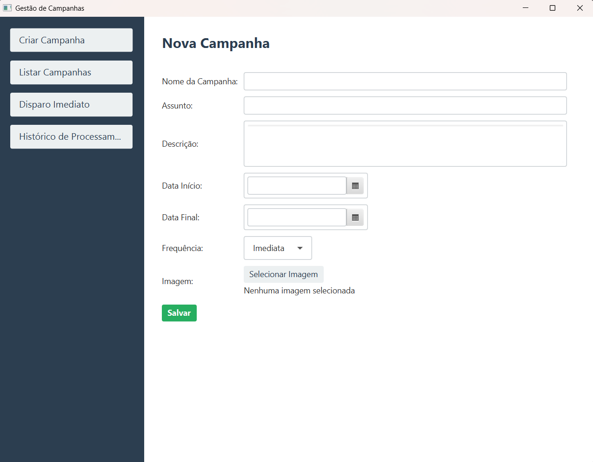
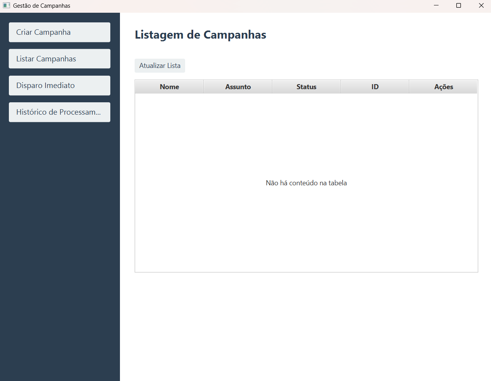
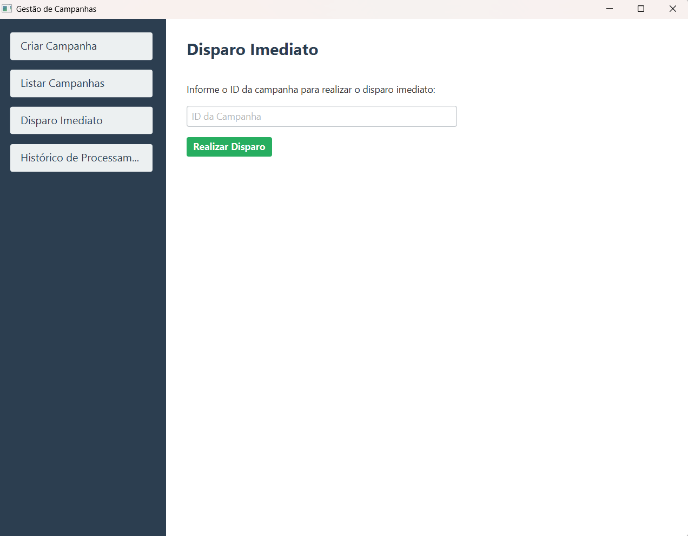

# Sistema de Gestão de Campanhas

Este é um aplicativo desktop desenvolvido em Java (JavaFX) para gerenciamento de campanhas de marketing. O sistema permite criar, editar, listar campanhas e visualizar o histórico de processamento, além de simular disparos imediatos.

## 🚀 Funcionalidades

*   **Criar Campanha**: Cadastro completo com nome, assunto, descrição, datas, frequência e imagem.
*   **Listar Campanhas**: Visualização de todas as campanhas cadastradas com opção de edição.
*   **Editar Campanha**: Alteração de dados existentes, com visualização e cópia facilitada do ID da campanha.
*   **Disparo Imediato**: Simulação de envio imediato de uma campanha através do seu ID.
*   **Histórico de Processamento**: Registro detalhado de todas as ações (criação, atualização, disparos) com data, hora e tipo de evento.

## 📸 Screenshots

### Tela Inicial / Cadastro


### Listagem de Campanhas


### Disparo Imediato


## 🛠️ Tecnologias Utilizadas

*   **Java 21 (OpenJDK)**
*   **JavaFX**: Para a interface gráfica.
*   **Maven**: Para gerenciamento de dependências e build.

## 📋 Pré-requisitos

Antes de começar, você precisará ter instalado em sua máquina:

1.  **Java JDK 21**: [Download OpenJDK 21](https://jdk.java.net/21/)
2.  **Maven**: [Download Maven](https://maven.apache.org/download.cgi)

## 🔧 Como Rodar o Projeto

1.  **Clone o repositório** (ou baixe os arquivos):
    ```bash
    git clone <url-do-seu-repositorio>
    cd PublicacaoCampanhas
    ```

2.  **Compile e Execute** usando o Maven:
    Abra o terminal na pasta raiz do projeto (onde está o arquivo `pom.xml`) e execute:

    ```bash
    mvn javafx:run
    ```

## 📖 Guia de Uso Rápido

1.  **Criar**: No menu lateral, clique em "Criar Campanha". Preencha os dados e salve.
2.  **Listar/Editar**: Vá em "Listar Campanhas". Clique em "Editar" na linha da campanha desejada.
3.  **Copiar ID**: Na tela de edição, use o botão "Copiar" ao lado do campo ID.
4.  **Disparar**: Vá em "Disparo Imediato", cole o ID e clique em "Realizar Disparo".
5.  **Ver Histórico**: Vá em "Histórico de Processamento" para ver todos os registros ou busque por um ID específico.

## ⚠️ Observação Importante

Este aplicativo utiliza **armazenamento em memória**. Isso significa que **todos os dados serão perdidos** ao fechar a aplicação. Para persistência de dados, seria necessário integrar com um banco de dados (ex: SQLite, MySQL).
